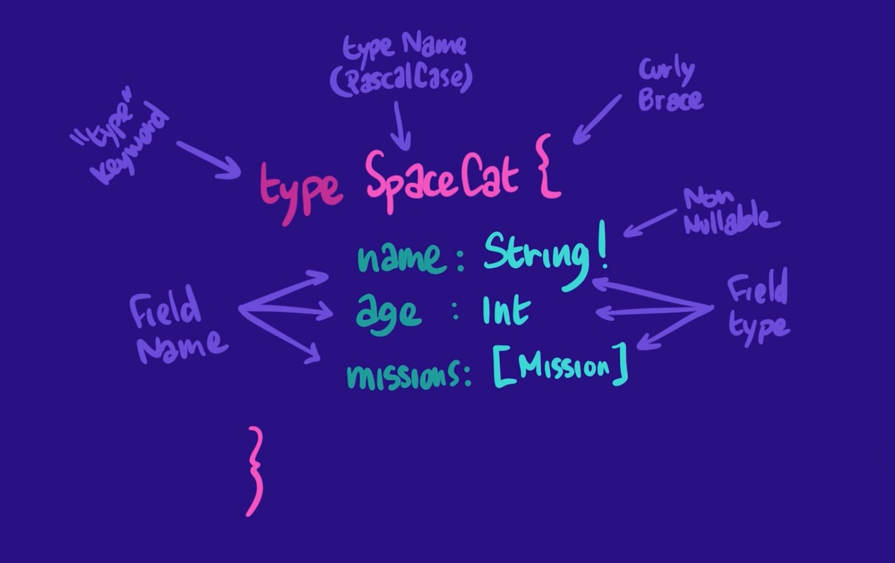
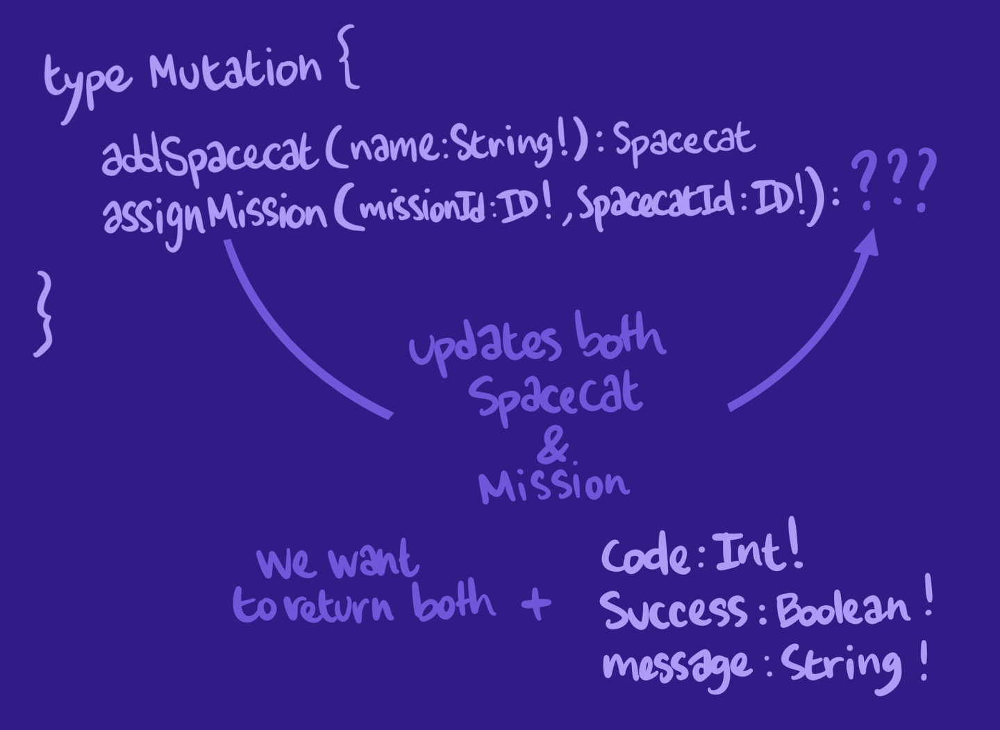
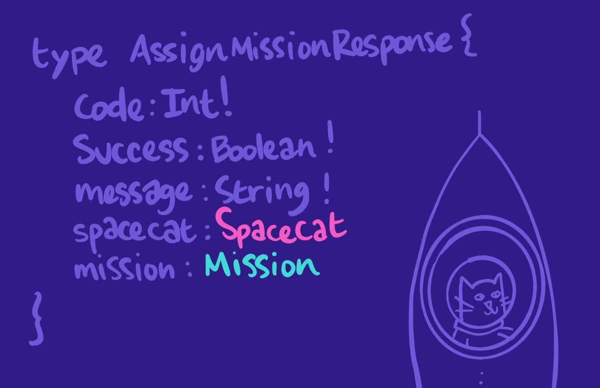

Q) What accurately describes a graph in GraphQL?
Tags) graphql
A) 
- It's a collection of nodes and edges
- It's a representation of our app's data

Q) In simplest terms what is a schema in Graphql?
Tags) graphql
A) It's a collection of `object types` that contain `fields`.

Q) What is the best practice for name of a type in graphql?
Tags) graphql
A) PascalCase
```graphql
  type SpaceCat {
    # Fields go here
  }
```

Q) Give an example of graphql type using SDL(Schema Definition Language)
Tags) graphql
A) 

Q) How to write description for a schema?
Tags) graphql
A) 
```graphql

"I'm a regular description"
type SpaceCat {

}

"""
I'm a block description
with a line break
"""
type SpaceCat {
  "I am description of the field"
  name: String!
}
```

Q) What is the use of `graphql-tag` package?
Tags) graphql
A) It provides tag template literal, used for wrapping Graphql strings like schema definition. It converts GraphQL string into the format Apollo libraries expect.
It also enables syntax highlighting.

Q) What's the naming convention for query names?
Tags) graphql
A) ALL_CAPS
```javascript
const TRACKS = gql`
  #Query goes here
`;
```


Q) Is Mutation a type?
Tags) graphql
A) Yes `Mutation` is a type like `Query`, it serves as an entry to our schema.
```graphql
  type Mutation {
    addSpaceCat(name: String!): SpaceCat
  }
```

Q) What is a good way to name mutations?
Tags) graphql
A) Start with a verb that describes the specific action of our update operation: `add, delete or create` followed by whatever data the mutation acts on. Eg:
```
  deleteMission
  createMission
```

Q) When a mutation updates more than one object, which one should we return? In addition what common fields should be added to a mutation response?
Tags) graphql, mutation
A) We should return all the updated objects because our client might need to use them to update the UI and then doesn't need to query another API. 
These should be the additional commond fields in a mutation response:

- `code`: an Int that refers to the status of the response, similar to an HTTP status code.

- `success`: a Boolean flag that indicates whether all the updates the mutation was responsible for succeeded.

- `message`: a String to display information about the result of the mutation on the client side. This is particularly useful if the mutation was only partially successful and a generic error message can't tell the whole story.



Create a separate mutation response type in multiple response case.


Q) When returning a response for mutation, why should the type of the data being returned should be nullable?
Tags) graphql, mutation
A) Because there might be an error in mutating the data and hence we need to return null.

Q) When calling a `*DataSource` in Apollo graphql, how to catch errors?
Tags) graphql, apollo
A) 
```graphql
incrementTrackViews: async (_, {id}, {dataSources}) => {
  try {
    const track = await dataSources.trackAPI.incrementTrackViews(id);
    return {
      code: 200,
      success: true,
      message: `Successfully incremented number of views for track ${id}`,
      track
    };
  } catch (err) {
    return {
      code: err.extensions.response.status,
      success: false,
      message: err.extensions.response.body,
      track: null
    };
  }
},
```

Q) Which hook do we need to use for calling mutation from client react side?
Tags) graphql, mutation
A) `useMutation`

Q) What does calling `useMutation` return?
Tags) graphql, mutation
A) It returns an array with 2 elements. First is the function which will actually be used to call the mutation , second contains the state of the mutation call: `loading, error and data`
```tsx
const [incrementTrackViews, { loading, error, data }] = useMutation(
  INCREMENT_TRACK_VIEWS,
  {
    variables: { incrementTrackViewsId: id },
  }
);
```

Q) On the client side (React) when do we need to regenerate types in graphql?
Tags) graphql, types
A) When we add a new operation like a query or mutation. For example when we add a new mutation to update the authentication state.

Q) Which data structure does graphql use to check if a query is valid?
Tags) graphql
A) Abstract Syntax Tree

Q) Is the resolver function executed for every field in a query?
Tags) graphql
A) Yes

Q) Which of these are responsibilities of a resolver function?
[ ] Retrieving the correct data from a source such as a database or a REST API
[ ] Populating its corresponding field with data
[ ] Constructing an AST from each incoming GraphQL query string
Tags) graphql
A) 
[x] Retrieving the correct data from a source such as a database or a REST API
[x] Populating its corresponding field with data
[x] Constructing an AST from each incoming GraphQL query string

Q) What questions to ask ourselves before designing graphql schema?
Tags) graphql
A) 
1. Where is our data stored, and how is it structured?
2. Is that structure different from our client app's needs and schema?
3. How can our resolver function access that data?

Q) What if the API from where you will resolve data using graphql contains bunch of extra stuff that you don't need?
Tags) graphql
A) The resolver function can filter out the properties that are required

Q) Can a graphql API connect to multiple data sources?
Tags) graphql
A) Yes

Q) What is a N + 1 problem in API call?
Tags) http
A) When we make 1 call to fetch top level data and subsequent N calls to retrieve child data which is same in every call.

Q) What is RESTDataSource?
Tags) graphql
A) It is a substitue for fetch in graphql. It helps in caching and deduplication of REST API calls out of the box.

Q) When to use encodeURIComponent?
Tags) security
A) To prevent malicious clients from accessing or manipulating data they shouldn't be, we recommend using the encodeURIComponent function for any HTTP path that accepts dynamic input.
```javascript
getAuthor(authorId) {
  return this.get(`author/${encodeURIComponent(authorId)}`);
}
```

Q) What should a resolver's name correspond to?
Tags) graphql
A) A resolver's name should correspond to its field name.

Q) Explain a resolver's params: `parent, args, contextValue, info`
Tags) graphql
A) `parent` is the returned value of the resolver for the field's parent. This will be useful when dealing with resolver chains.
`args` contains all GraphQL arguments that were provided for the field by the GraphQL operation.
`contextValue` is an object shared across all resolvers that are executing for a particular operation. The resolver needs this argument to share state, like authentication information, a database connection, or a DataSource.
`info` contains information about the operation's execution staet, including the field name, the path to the field from the root, and more. It's not used as frequently as the others, but it can be useful for more advanced actions like setting cache policies at the resolver level.You c

Q) How to pass contextValue to your resolver function?
Tags) graphql
A) Where we have initialised apollo server and started the standalone apollo server. We can do something like this:
```javascript
 const { url } = await startStandaloneServer(server, {
    context: async () => {
      return {
        dataSources: {
          trackAPI: new TrackAPI(),
        },
      };
    },
  });

```

Q) Within a graphql server response, which keys can you expect to find in the JSON object?
Tags) graphql
A) 
1. `errors` key
2. `data` key

Q) Is it possible to get partial response from a graphql query in case of an error?
Tags) graphql
A) Yes

Q) When you query a graphql field that is not in the schema, what error code will the server send?
Tags) graphql
A) `GRAPHQL_VALIDATION_FAILED`

Q) How to setup an apollo client?
Tags) graphql
A)
```jsx
  import { ApolloProvider, ApolloClient, InMemoryCache } from '@apollo/client';

  const client = new ApolloClient({
    uri: 'http://localhost:4000',
    cache: new InMemoryCache(),
  });

  ReactDOM.render(
    <ApolloProvider client={client}>
      <GlobalStyles />
      <Pages />
    </ApolloProvider>,
    document.getElementById('root')
  );
```

Q) Given this schema field: missions: [Mission!], what does it mean?
Tags) graphql
A) The list's items can't be null

Q) Where can we add entry points to our schema?
Tags) graphql
A) In the Query type

Q) Give examples of how to pass arguments
Tags) graphql
A) 
```
  type Query {
    "argument is mandatory and of type id and returns a SpaceCat object"
    spacecat(id: ID!): SpaceCat
    "accepts 2 arguments: to of nullable type String and scheduled of nullable type Boolean"
    missions(to: String, scheduled: Boolean): [Mission]
  }
```

Q) What is a resolver chain?
Tags) graphql
A)
A graphql query in many cases has nested fields. We can associate resolvers for every field. When we write resolvers for nested fields and take advantage of the data inside the parent which was returned through parent resolver, it is called resolver chaining.
```graphql 
  query track(id: ‘c_0') {
    title
    author {
      name
    }
  }
```
Here we can write a resolver for author and use the trackId from the parent to get that data.

Q) How to make sure that a query accepts a non-nullable string variable isPresent?
Tags) graphql
A) 
```graphql

  query getData($isPresent: String!){
    title
  }

```

Q) How to pass a trackId variable from client side using useQuery?
Tags) graphql
A)
```typescript
  const { loading, error, data } = useQuery( MY_QUERY, { variables: { trackId }});
```

Q)